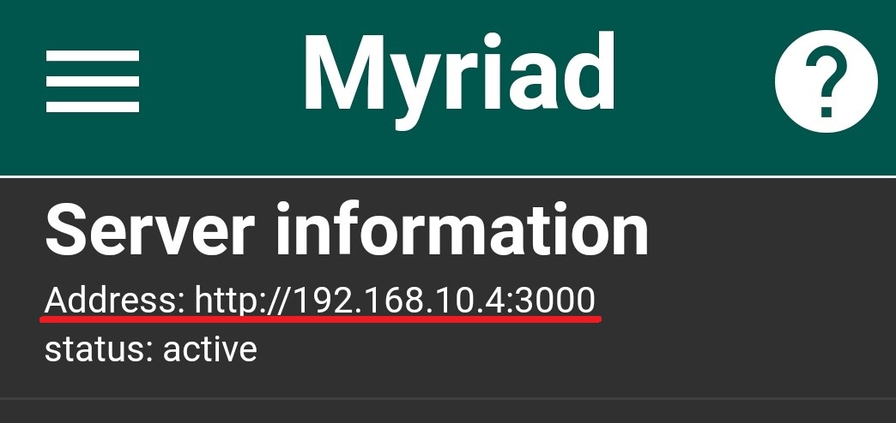
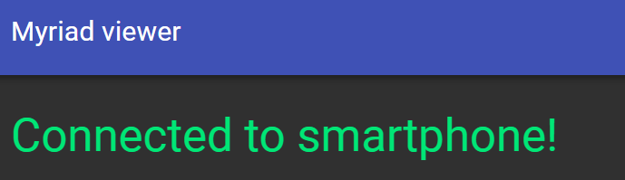
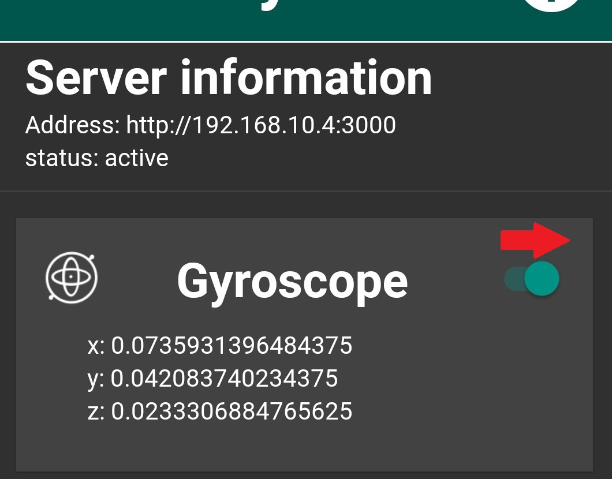
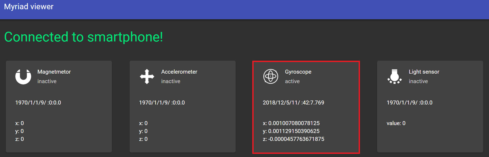

# MyriadApi

## Myriad Apiとは
スマートフォンをAPIサーバー化し、PC等の他のデバイスからからRest API経由でスマートフォンからセンサー情報を取得したり、スマートフォンを遠隔操作出来るようにするアプリです。

play storeからダウンロード可能です。
  
iPhone版についても開発を予定しています。

## Getting Started

### 事前準備  
・スマートフォン  
・パソコン  
  
注意: API化するスマホと操作するデバイスは同じローカルネットワーク(無線LAN)を使用している必要があります。無線LANの環境が無い場合、スマートフォンのテザリングやDirect Wifiで利用する事も可能です。テザリングを利用する場合、通信利用料がかかる可能性がありますので、モバイルデータ通信を止める事をおすすめします。

1. まずはアプリをPlayストアからダウンロードして、起動してください  

1. アプリ上部に表示されているアドレスをメモして、PCのブラウザからアクセスしてみましょう。  

1. PCのブラウザで表示されたページの上部にConnected Smartphoneと表示されれば準備OKです。  

1. アプリに表示されているセンサーのスイッチを入れてみましょう。   

1. ブラウザに表示されているセンサー類の内容が更新されるはずです！

1. これで準備完了です!
###  もっと詳しく
Scratch3と繋げて遊ぶ  
api ドキュメント  
