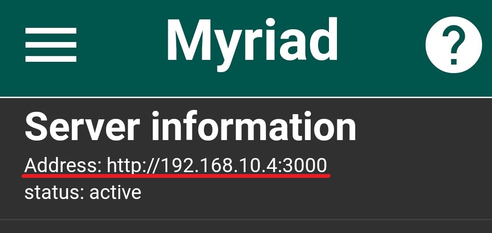
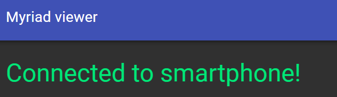
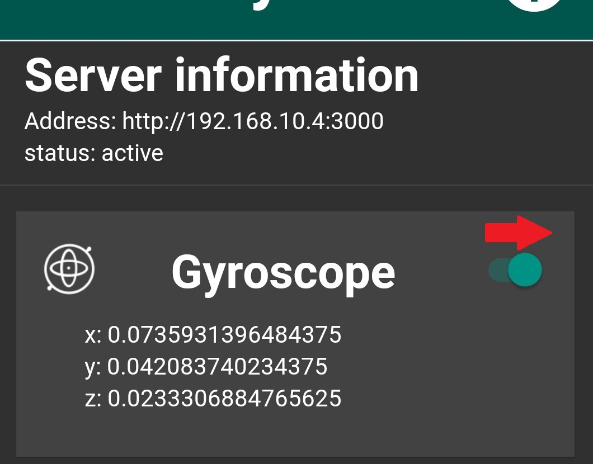
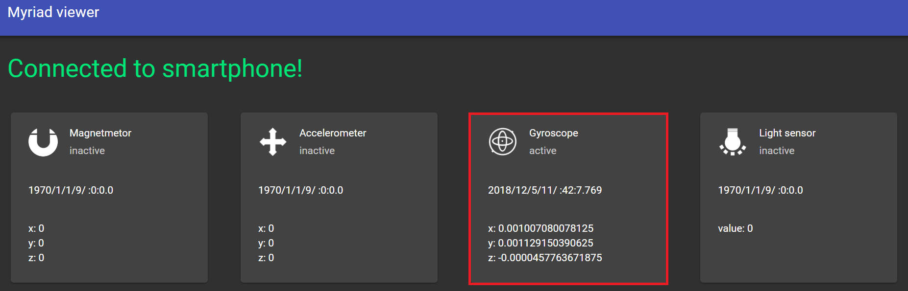

## Myriad Apiとは
PC等の他のデバイスからからRest API経由でスマートフォンからセンサー情報を取得したり、操作出来るようにするアプリです。 
Scratch３や 簡単なスクリプトでスマートフォンのセンサー類からデータが取得出来ます。最近、色んなIoTや電子工作をするキットが発売されてますが、まずはお手持ちのスマートフォンでIoT工作してみてはどうでしょうか？    
ベータ版です。  
  

  
iPhone版についても開発を予定しています。

###  使い方
[チュートリアル(PCとアプリ接続確認)](#tutorial)  
[curlでAPIを呼び出す](/curl/readme.md)    
[Scratch3で遊ぶ](https://myriadapi.github.io/myriad_scratch3_blocks/ja/)    
[api ドキュメント](/api)   

## チュートリアル
ここではスマートフォン(アプリ)とPCの接続確認をします。
### 事前準備  
・スマートフォン  
・パソコン  
  
注意: スマートフォンとPCは同じローカルネットワーク(無線LAN)を使用している必要があります。無線LANの環境が無い場合、スマートフォンのテザリングやDirect Wifiで利用する事で接続も可能です。テザリングを利用する場合、通信利用料がかかる可能性がありますので、ご注意ください。

1. まずはアプリをPlayストアからダウンロードして、起動してください  

1. アプリ上部に表示されているアドレスをメモして、PCのブラウザ(ChromeやSafari、Firefox)からアクセスしてみましょう。  

1. PCのブラウザで表示されたページの上部にConnected Smartphoneと表示されれば準備OKです。  

1. アプリに表示されているGyroscopeのスイッチを入れてみましょう。   

1. ブラウザに表示されているGyroscopeの内容が更新されるはずです！  
  
    
###  次のステップ  
[curlでAPIを呼び出す](/curl/readme.md)    
[Scratch3で遊ぶ](https://myriadapi.github.io/myriad_scratch3_blocks/ja/)    
[api ドキュメント](/api)   
